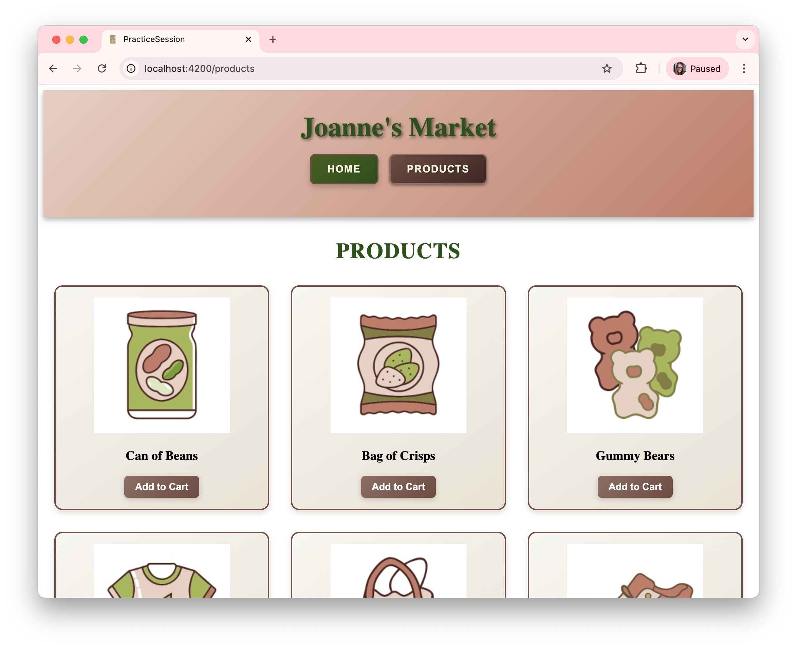

# PracticeSession

**Author:** Joanne!

Welcome to your personalized PracticeSession project. This project demonstrates an everyday market app, showcasing how to build a modern, reusable, and scalable Angular application for real-world shopping scenarios. You'll find examples of reusable components, parent-child communication, and best practices for building a user-friendly market experience.

This project was generated using [Angular CLI](https://github.com/angular/angular-cli) version 21.1.1.


## Practice Activities (Module 3)

- [Practice Activity 1: Advanced Angular Routing](Module%203%20Practice%20Activity%201.md)
	- Learn advanced Angular routing, route parameters, and component input binding with routes.
- [Practice Activity 2: Angular Search & Filtering with Signals](Module%203%20Practice%20Activity%202.md)
	- Build a search form using Angular signals, filter product lists dynamically, and sync search state with query parameters.
- [Practice Activity 4: Angular Reactive Forms & Custom Validation](Module%203%20Practice%20Activity%204.md)
	- Create and validate Angular reactive forms, implement custom validators, and handle navigation after form submission.

> Note: Practice Activity 3 covers React form validation and routing (see [Module 3 Practice Activity 3](Module%203%20Practice%20Activity%203.md)).

Earlier activities (Module 1 & 2) are available in their respective guides.

## Screenshot



## Development server

To start a local development server, run:

```bash
ng serve
```

Once the server is running, open your browser and navigate to `http://localhost:4200/`. The application will automatically reload whenever you modify any of the source files.

## Code scaffolding

Angular CLI includes powerful code scaffolding tools. To generate a new component, run:

```bash
ng generate component component-name
```

For a complete list of available schematics (such as `components`, `directives`, or `pipes`), run:

```bash
ng generate --help
```

## Building

To build the project run:

```bash
ng build
```

This will compile your project and store the build artifacts in the `dist/` directory. By default, the production build optimizes your application for performance and speed.

## Running unit tests

To execute unit tests with the [Vitest](https://vitest.dev/) test runner, use the following command:

```bash
ng test
```

## Linting the Project

To check your code for style and programming errors, run the linter:

```bash
ng lint
```

This will analyze your code and report any issues based on the project's linting configuration. Fixing lint errors helps keep your code clean and consistent.


## Credits

Images in this project were created using Recraft AI.
Styles were generated and refined with GitHub Copilot.

## Additional Resources

For more information on using the Angular CLI, including detailed command references, visit the [Angular CLI Overview and Command Reference](https://angular.dev/tools/cli) page.
